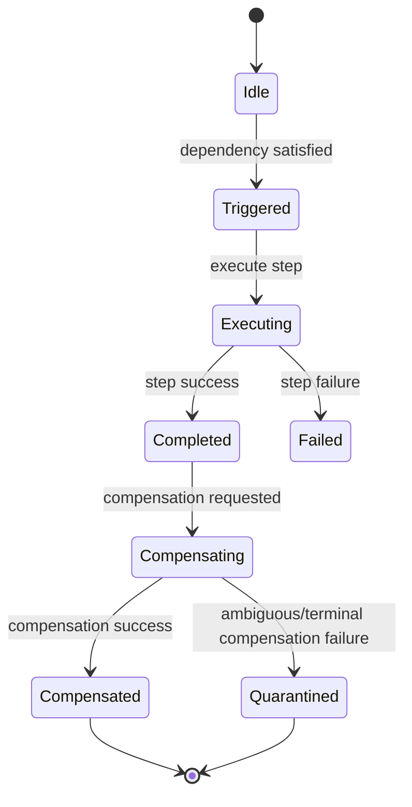

# icanact-saga-choreography Architecture

## What This Is

`icanact-saga-choreography` is a Rust crate for running choreography-based sagas inside `icanact-core` actors.

The key idea is simple: actors already represent service boundaries, so saga participation is implemented as actor behavior, not as a separate central orchestrator.

## Core Model

- Each saga participant is a normal actor that handles business messages plus saga events.
- Participants communicate through pubsub saga events (`SagaChoreographyEvent`).
- Each participant should embed one `SagaParticipantSupport<J, D>` field that owns local choreography state keyed by `SagaId`.
- Each participant persists participant-local events to a journal and deduplicates incoming events.
- Failure handling is compensation-driven, with quarantine for ambiguous compensation outcomes.

## Architecture At A Glance

## Framework vs Actor Responsibilities

| Area | Framework (`icanact-saga-choreography`) | Actor Implementation |
|---|---|---|
| Identity and context | `SagaId`, `SagaContext`, `IdempotencyKey` | Populate context at saga start and across steps |
| State model | Typestate containers and transitions (`Idle`, `Executing`, `Completed`, etc.) plus `SagaParticipantSupport<J, D>` | Embed one `saga` field on the actor |
| Events | `SagaChoreographyEvent`, `ParticipantEvent` | Publish/consume events for the saga type |
| Execution contract | `SagaParticipant` trait | Implement `execute_step`, `compensate_step`, dependencies, retry policy |
| State access contract | `HasSagaParticipantSupport` + blanket `SagaStateExt` | Expose the embedded `saga` field |
| Persistence contract | `ParticipantJournal` and `ParticipantDedupeStore` traits | Provide concrete backend (in-memory, LMDB/Heed, etc.) |
| Runtime helpers | `handle_saga_event`, `execute_step_wrapper`, `compensate_wrapper`, `recover_sagas` | Wire helpers into actor message handling |
| Observability | `ParticipantStats`, `SagaObserver` | Export metrics and connect observer implementation |

## Participant State Machine

## Event Lifecycle

## How We Use It

1. Define the saga type and step names for the workflow.
2. Add `saga: SagaParticipantSupport<Journal, Dedupe>` to each participant actor.
3. Implement `HasSagaParticipantSupport` for the actor. `SagaStateExt` is then derived automatically.
4. Implement `SagaParticipant` for business behavior:
   step identity, forward execution, compensation, dependencies, retry policy.
5. Add a saga event variant to the actor command enum and route it to `handle_saga_event`.
6. Subscribe each actor mailbox to the saga topic (`saga:{saga_type}`).
7. Start sagas by publishing `SagaStarted` with payload and context.
8. Run recovery on startup (`recover_sagas`) and expose stats/admin commands.

## Storage and Idempotency

- Journal records participant-local events in append order (`ParticipantEvent`).
- Dedupe store prevents duplicate processing for the same saga event.
- The framework uses a dedupe key of `trace_id:event_type` when handling incoming events.
- In this repository, in-memory implementations are available for tests/examples.
- For production, use a durable backend by implementing the storage traits (for example LMDB/Heed).

## Recovery, Cleanup, and Operations

- Recovery enumerates known saga IDs from the journal and rebuilds coarse state from event history.
- Non-terminal sagas are returned for resume/reconciliation.
- On terminal saga events (`SagaCompleted` or `SagaFailed`), participants prune local in-memory state and dedupe keys.
- Quarantined sagas are intentionally preserved for manual investigation.

## Observability

- `ParticipantStats` tracks key counters:
  events received/relevant/duplicate, steps started/completed/failed, compensations started/completed, and quarantined sagas.
- `SagaObserver` allows external hooks for lifecycle and failure telemetry.
- `TracingObserver` provides structured tracing integration out of the box.
