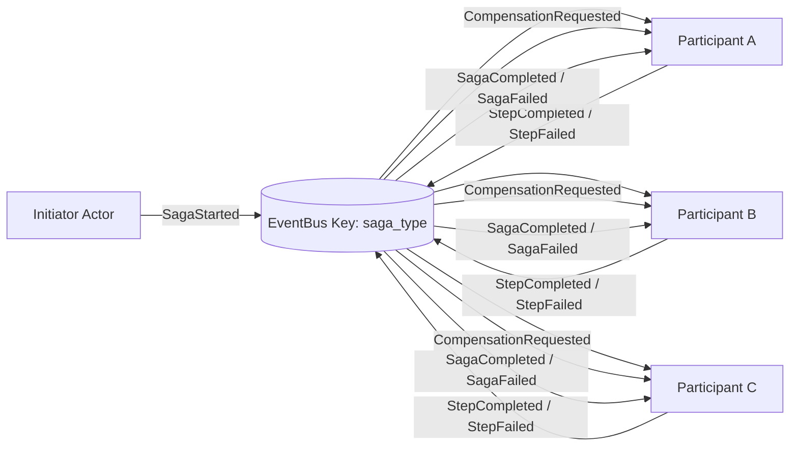
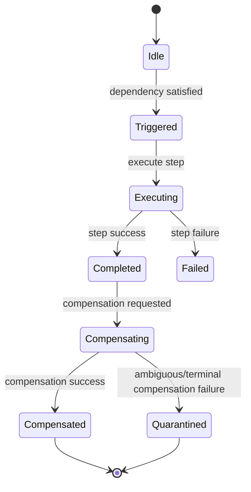
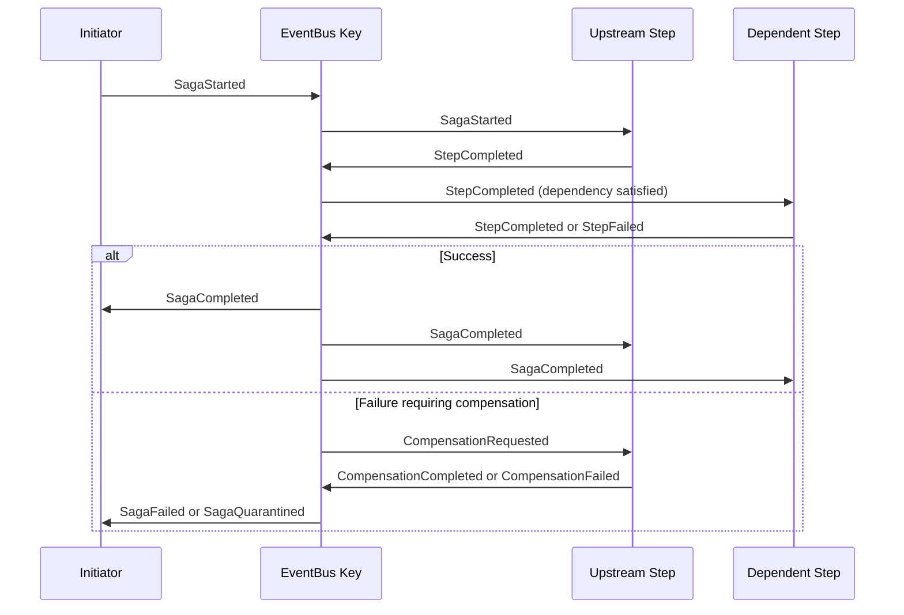

# icanact-saga-choreography Architecture

## What This Is

`icanact-saga-choreography` is a Rust crate for running choreography-based sagas inside `icanact-core` actors.

The key idea is simple: actors already represent service boundaries, so saga participation is implemented as actor behavior, not as a separate central orchestrator.

## Core Model

- Each saga participant is a normal actor that handles business messages plus saga events.
- Participants communicate through saga event bus events (`SagaChoreographyEvent`).
- Each participant should embed one `SagaParticipantSupport<J, D>` field that owns local choreography state keyed by `SagaId`.
- Each participant persists participant-local events to a journal and deduplicates incoming events.
- Failure handling is compensation-driven, with quarantine for ambiguous compensation outcomes.
- Startup is contract-gated: the bus requires workflow contract + terminal policy + bound participant steps before accepting `SagaStarted`.

## Startup Hardening Invariants

At saga start, framework enforcement is fail-fast:

- Missing terminal policy for the saga type: immediate `SagaFailed`.
- Missing workflow contract for the saga type: immediate `SagaFailed`.
- `SagaStarted.context.step_name` does not match contract `first_step`: immediate `SagaFailed`.
- Any declared contract step is not bound to a participant: immediate `SagaFailed` with `missing_steps=...`.
- Live start-event fanout below contract minimum (`declared_steps + terminal_resolver`): immediate `SagaFailed` (prevents latent stalls from stale/unwired subscribers).
- Invalid workflow contracts are rejected at registration (duplicate steps, undeclared dependencies, cycles, required terminal steps missing).

This prevents runtime “partial wiring” where a saga starts and then stalls waiting for steps that can never run.

## Architecture At A Glance

## Framework vs Actor Responsibilities

| Area | Framework (`icanact-saga-choreography`) | Actor Implementation |
|---|---|---|
| Identity and context | `SagaId`, `SagaContext`, `IdempotencyKey` | Populate context at saga start and across steps |
| State model | Typestate containers and transitions (`Idle`, `Executing`, `Completed`, etc.) plus `SagaParticipantSupport<J, D>` | Embed one `saga` field on the actor |
| Events | `SagaChoreographyEvent`, `ParticipantEvent` | Publish/consume events for the saga type |
| Execution contract | `SagaParticipant` trait | Implement `execute_step`, `compensate_step`, and dependencies |
| Workflow contract | `SagaWorkflowContract`, `validate_workflow_contract`, `define_saga_workflow_contract!` | Declare stable saga graph (`first_step`, step dependencies, terminal criteria) |
| Start gating | Saga bus enforces registered contract + terminal policy + bound steps before accepting `SagaStarted` | Ensure startup registers all required contracts/bindings |
| State access contract | `HasSagaParticipantSupport` + blanket `SagaStateExt` | Expose the embedded `saga` field |
| Persistence contract | `ParticipantJournal` and `ParticipantDedupeStore` traits | Provide concrete backend (in-memory, LMDB/Heed, etc.) |
| Runtime helpers | `apply_sync_participant_saga_ingress`, `apply_async_participant_saga_ingress`, strict workflow binding helpers (`bind_*_workflow_participant_*_strict`) | Wire ingress helpers into actor message handling and bind workflow participants strictly |
| Observability | `ParticipantStats`, `SagaObserver` | Export metrics and connect observer implementation |
| E2E test harness | `SagaTestWorld`, transcript capture, terminal waits | Spawn real actors and assert through actor refs, transcript, and shared stores |

## Participant State Machine

## Event Lifecycle

## How We Use It

1. Define a `SagaWorkflowContract` for the workflow (`saga_type`, `first_step`, step graph, terminal policy).
2. Add `saga: SagaParticipantSupport<Journal, Dedupe>` to each participant actor.
3. Implement `HasSagaParticipantSupport` for the actor. `SagaStateExt` is then derived automatically.
4. Implement `SagaParticipant` for business behavior:
   step identity, forward execution, compensation, and dependencies.
5. Add a saga event variant to the actor command enum and route it through `apply_sync_participant_saga_ingress(...)` or `apply_async_participant_saga_ingress(...)`.
6. On startup, register workflow contract and attach terminal resolver.
7. Bind participants and register bound steps:
   use strict workflow bind helpers for `HasSagaWorkflowParticipants`, otherwise register steps explicitly.
8. Start sagas by publishing `SagaStarted` with context step name exactly equal to contract `first_step`.
9. Run recovery/reconciliation on startup via your durability layer and expose stats/admin commands.

## Testing Model

- The deterministic replay helpers remain useful for narrow unit tests.
- The intended end-to-end path is `SagaTestWorld` with real actor refs and a real `SagaChoreographyBus`.
- `SagaTestWorld` owns the bus wiring, transcript capture, and terminal waiting so tests can execute the same workflow code production actors use.
- Assertions should prefer:
  terminal outcomes, transcript inspection, actor `ask` snapshots, and shared journal/dedupe stores when the test injects them.
- The harness should not require a test-only alternate workflow implementation.

## Storage and Idempotency

- Journal records participant-local events in append order (`ParticipantEvent`).
- Dedupe store prevents duplicate processing for the same saga event.
- The framework uses a dedupe key of `trace_id:event_type` when handling incoming events.
- In this repository, in-memory implementations are available for tests/examples.
- For production, use a durable backend by implementing the storage traits (for example LMDB/Heed).

## Recovery, Cleanup, and Operations

- Recovery enumerates known saga IDs from the journal and rebuilds coarse state from event history.
- Non-terminal sagas are returned for resume/reconciliation.
- On terminal saga events (`SagaCompleted` or `SagaFailed`), participants prune local in-memory state and dedupe keys.
- Quarantined sagas are intentionally preserved for manual investigation.
- Terminal policies support two timeout dimensions:
  - `overall_timeout` (overall wall clock)
  - `stalled_timeout` (watchdog reset by each progress event)

## Observability

- `ParticipantStats` tracks key counters:
  events received/relevant/duplicate, steps started/completed/failed, compensations started/completed, and quarantined sagas.
- `SagaObserver` allows external hooks for lifecycle and failure telemetry.
- `TracingObserver` provides structured tracing integration out of the box.
